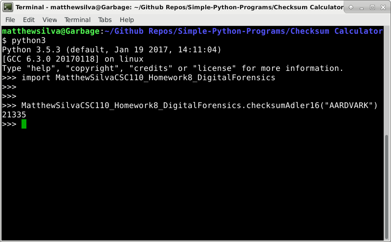

# Simple-Python-Programs

TESTED ON DEBIAN STRETCH

Installation:

	Install Python 3:

	sudo apt-get install python3
	
	
	For Using Runp:
	
	sudo apt-get install python-pip
	
	pip install runp
	
Running Code:

Any Python program WITH a main function can be run using the below commands
	
	python3 <executable>
	
	e.g.
	
	python3 Matthew\ Silva\ CSC\ 110\ -\ Homework\ 5\ -\ Working\ with\ Files.py
	
	
	OR
	
	
	./<executable>
	
	e.g.
	
	./Matthew\ Silva\ CSC\ 110\ -\ Homework\ 5\ -\ Working\ with\ Files.py
	
	
	OR
	
	
	python3
	
	(entered shell)
	>>> import <executableWithout.py>
	
	>>> <executableWithout.py>.main()
	
	e.g.
	
	python3
	
	(entered shell)
	>>> import MatthewSilvaCSC110_Homework5_WorkingwithFiles
	
	>>> MatthewSilvaCSC110_Homework5_WorkingwithFiles.main()
	
	
	OR
	
	
	python3 -c 'from <executableWithout.py> import *;  main()'
	
	e.g. 
	
	python3 -c 'from MatthewSilvaCSC110_Homework5_WorkingwithFiles import *;  main()'
	
	
Any Python program WITHOUT a main function can be run using the below commands	
	
	python3 -c 'from <executableWithout.py> import *; print(<functionName>(<functionParameters>))'
	
	e.g.
	
	python3 -c 'from MatthewSilvaCSC110_Homework7_1_Cryptography import *; print(caesarPlus("apple",3))'
	
	
	OR
	
	
	python3
	
	(entered shell)
	>>> import <executableWithout.py>
	
	>>> <executableWithout.py>.<functionName>(<functionParameters>)
	
	e.g.
	
	python3
	
	(entered shell)
	>>> import MatthewSilvaCSC110_Homework7_1_Cryptography
	
	>>> MatthewSilvaCSC110_Homework5_WorkingwithFiles.caesarPlus("orange",3)
	
